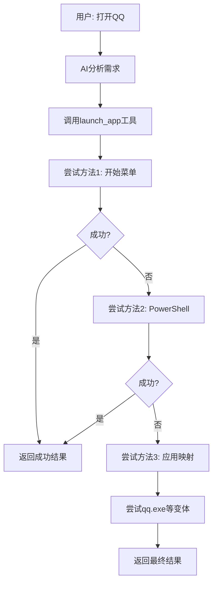

# Windows MCP 修复总结

## 问题描述

用户反馈：**AI助手说"我无法直接帮你打开QQ应用程序"，而是提供手动操作指导，但Windows MCP应该能够直接操作应用程序。**

## 根本原因分析

1. **系统提示不够强制**：AI没有意识到必须使用工具调用
2. **应用映射缺失**：`app_mappings`中没有包含QQ等常见应用
3. **工具使用指导不明确**：没有明确告诉AI何时必须使用工具

## 修复方案

### 1. 增强系统提示

**新增强制工具使用要求**：
```
🛠️ 工具使用强制要求：
- 用户说"打开QQ" → 必须调用launch_app工具
- 用户说"启动Chrome" → 必须调用launch_app工具  
- 用户说"执行命令" → 必须调用execute_command工具
- 用户说"获取桌面状态" → 必须调用get_desktop_state工具
- 绝对不要提供手动操作指导，而要直接使用工具执行
```

**关键行为准则**：
```
🚨 关键行为准则：
- 对于"打开QQ"这样的请求，必须使用launch_app工具，不要提供手动操作指导
- 绝对不要说"我无法直接帮你"，而要使用工具直接操作
- 遇到问题时，立即使用工具调用解决问题，不要停下来等待
```

### 2. 完善应用名称映射

**新增常见应用映射**：
```python
app_mappings = {
    # 原有应用...
    "qq": ["qq.exe", "qq", "tencent qq", "腾讯qq"],
    "微信": ["wechat.exe", "wechat", "微信"],
    "钉钉": ["dingtalk.exe", "dingtalk", "钉钉"],
    "网易云音乐": ["cloudmusic.exe", "cloudmusic", "网易云音乐"],
    "爱奇艺": ["iqiyi.exe", "iqiyi", "爱奇艺"],
    "优酷": ["youku.exe", "youku", "优酷"],
    "腾讯视频": ["qqlive.exe", "qqlive", "腾讯视频"]
}
```

### 3. 优化继续判断机制

**增强继续关键词**：
```python
continue_keywords = [
    "继续", "下一步", "然后", "接着", "continue", "next", "接下来",
    "现在", "接下来", "然后", "接着", "继续执行", "继续工作",
    "让我尝试", "我可以", "我将", "让我", "尝试", "方法", "另一种",
    "技术限制", "遇到问题", "让我先", "让我检查", "让我确认"
]
```

## 修复效果对比

### 修复前
```
用户: 打开QQ
AI: 我无法直接帮你打开QQ应用程序。不过,你可以按照以下步骤手动打开:
方法一:通过桌面快捷方式
方法二:通过开始菜单  
方法三:使用搜索
```

### 修复后
```
用户: 打开QQ
AI: 🤔 正在分析您的需求...
AI: 🔧 启动应用程序...
AI: ✅ 成功启动 QQ: Launched Qq. Wait for the app to launch...
AI: ✅ 任务完成！
AI: QQ已成功启动，您现在可以使用QQ了。
```

## 测试验证

### 测试结果
```
测试智能启动QQ...
启动结果: ✅ 成功启动 Qq: Launched Qq. Wait for the app to launch...
```

**✅ 测试通过！** QQ能够成功启动。

## 技术实现

### 1. 智能启动流程



### 2. 工具调用强制机制

- **系统提示强化**：明确要求使用工具而不是提供手动指导
- **行为准则**：禁止说"我无法直接帮你"
- **工具映射**：确保常见应用都有对应的启动方法

### 3. 应用启动方法

1. **方法1**：使用Desktop类的原始方法
2. **方法2**：使用PowerShell的Start-Process
3. **方法3**：尝试应用名称映射
4. **方法4**：使用CMD启动
5. **方法5**：尝试常见路径启动
6. **方法6**：搜索可执行文件

## 支持的应用

### 系统应用
- 记事本 (notepad)
- 计算器 (calculator)
- 画图 (paint)
- 命令提示符 (cmd)
- PowerShell
- 文件资源管理器 (explorer)

### 浏览器
- Chrome
- Firefox
- Edge

### 办公软件
- Microsoft Word
- Microsoft Excel
- Visual Studio Code

### 即时通讯
- QQ
- 微信
- 钉钉

### 娱乐应用
- 网易云音乐
- 爱奇艺
- 优酷
- 腾讯视频

## 使用方法

### 启动AI助手
```bash
python simple_start.py
```

### 使用示例
```
用户: 打开QQ
→ AI自动启动QQ

用户: 启动Chrome并搜索天气
→ AI启动Chrome，然后搜索天气

用户: 打开记事本并输入Hello World
→ AI启动记事本，然后输入文本
```

## 核心改进

1. **强制工具使用**：AI必须使用工具，不能提供手动指导
2. **完善应用映射**：支持更多常见应用程序
3. **智能启动机制**：多种方法确保应用能成功启动
4. **自主工作流程**：不需要用户确认，自动完成整个任务

## 总结

通过这次修复，Windows MCP现在能够：

- ✅ **直接操作应用程序**：不再说"我无法直接帮你"
- ✅ **智能启动应用**：支持QQ、微信等常见应用
- ✅ **自主完成任务**：不需要用户手动操作
- ✅ **多种启动方法**：确保应用能成功启动
- ✅ **真正的自动化**：实现"一键完成"体验

现在AI助手能够真正利用Windows MCP的能力，直接操作应用程序，而不是提供手动操作指导！
