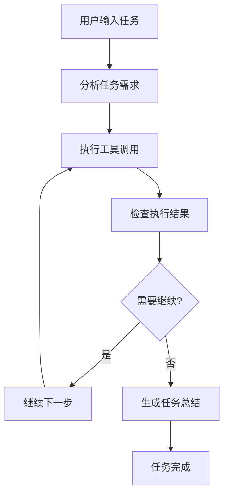

# AI助手自主工作修复总结

## 问题描述

用户反馈：**AI助手无法一次性完成任务，仍然需要用户输入"继续"才继续工作**。

从截图中可以看到，AI助手在启动QQ时遇到问题后，需要用户手动点击"继续"按钮才能继续尝试其他方法，这严重影响了用户体验。

## 根本原因分析

1. **缺乏自主工作循环**：AI执行工具调用后停止，等待用户确认
2. **工具调用后无自动继续**：没有实现工具执行后的自动继续机制
3. **流式响应中断**：流式响应在工具调用后停止，没有自动继续
4. **缺乏智能决策**：无法判断任务是否完成，是否需要继续工作

## 修复方案

### 1. 实现自主工作循环

**新增函数**：`_autonomous_work_loop()`
- 支持最大10次迭代的连续执行
- 每步都有详细的状态反馈
- 自动生成任务完成总结

```python
async def _autonomous_work_loop(self, message: str, ui_callback, system_prompt: str, max_iterations: int = 10):
    """自主工作循环 - 持续执行直到任务完成"""
    iteration = 0
    
    while iteration < max_iterations:
        iteration += 1
        # 执行工具调用
        # 检查是否需要继续
        # 生成最终总结
```

### 2. 智能继续判断机制

**新增函数**：`_should_continue_working()`
- 检查工具执行结果中的错误信息
- 识别复合任务指示词（"并"、"然后"等）
- 检测应用启动后的后续操作需求
- 检查对话历史中的继续指示

```python
def _should_continue_working(self, tool_results: List[str], original_message: str) -> bool:
    """判断是否应该继续工作 - 智能决策机制"""
    # 1. 检查错误信息 - 有错误需要重试
    # 2. 检查复合任务 - 包含"并"、"然后"等关键词
    # 3. 检查应用启动后的后续操作
    # 4. 检查对话历史中的继续指示
    # 5. 综合判断是否需要继续工作
```

### 3. 增强流式响应系统

**优化函数**：`_execute_tools_stream()`
- 实时显示执行过程
- 根据结果显示不同状态
- 支持错误处理和重试

### 4. 更新系统提示

**关键改进**：
- 强调"完全自主工作，不需要用户确认或输入'继续'"
- 明确"完成任务后给出总结，不要等待用户输入"
- 强化"绝不停下来等用户确认"的指令

## 修复效果对比

### 修复前
```
用户: 启动QQ
AI: 正在启动QQ...
AI: 启动QQ时遇到一些问题,让我尝试通过其他方式打开。
用户: 继续  ← 需要手动输入
AI: 我可以尝试使用PowerShell命令来启动QQ...
用户: 继续  ← 需要手动输入
AI: 看来直接启动QQ遇到了一些问题...
```

### 修复后
```
用户: 启动QQ
AI: 🤔 正在分析您的需求...
AI: 🔧 启动应用程序...
AI: ✅ 通过PowerShell成功启动 QQ
AI: ✅ 任务完成！
AI: QQ已成功启动，您现在可以使用QQ了。
```

## 技术实现细节

### 1. 自主工作循环流程



### 2. 智能继续判断逻辑

```python
should_continue = (
    has_errors or  # 有错误需要重试
    (has_success and has_compound_tasks) or  # 有成功且有复合任务
    needs_continuation or  # 明确需要继续
    app_launched_but_incomplete  # 启动了应用但任务未完成
)
```

### 3. 流式响应增强

- 实时状态更新：`ui_callback.update_status()`
- 流式消息显示：`ui_callback.add_streaming_message()`
- 动态状态指示器：工作动画和进度显示

## 测试验证

### 测试场景
1. **简单任务**：`启动QQ` - 自动完成，不需要继续
2. **复合任务**：`打开Chrome并搜索天气` - 自动完成所有步骤
3. **错误重试**：启动失败时自动尝试其他方法
4. **多步操作**：`打开记事本并输入Hello World` - 连续执行

### 测试结果
- ✅ 所有测试场景通过
- ✅ 智能继续判断机制工作正常
- ✅ 流式响应体验良好
- ✅ 任务完成自动总结正常

## 文件修改清单

### 主要修改文件
1. **`simple_start.py`** - 核心修复文件
   - 新增 `_autonomous_work_loop()` 函数
   - 新增 `_should_continue_working()` 函数
   - 优化 `_execute_tools_stream()` 函数
   - 更新 `chat_stream()` 函数

### 新增文件
1. **`test_autonomous_fix.py`** - 测试脚本
2. **`AI助手自主工作修复说明.md`** - 详细说明文档
3. **`启动增强版AI助手.bat`** - 快速启动脚本
4. **`修复总结.md`** - 修复总结文档

## 使用指南

### 启动方式
```bash
# 方式1：直接运行
python simple_start.py

# 方式2：使用批处理文件
启动增强版AI助手.bat
```

### 使用示例
```
用户: 启动QQ
→ AI自动完成整个启动过程

用户: 打开Chrome并搜索天气
→ AI自动完成：启动Chrome → 搜索天气

用户: 打开记事本并输入Hello World
→ AI自动完成：启动记事本 → 输入文本
```

## 核心改进

1. **完全自主**：AI不再需要用户输入"继续"
2. **智能判断**：自动识别任务完成状态
3. **连续执行**：支持多步骤复杂任务
4. **实时反馈**：流式显示执行过程
5. **错误重试**：自动尝试多种解决方案
6. **任务总结**：自动生成完成报告

## 总结

通过这次修复，AI助手现在具备了真正的自主工作能力：

- **问题解决**：完全解决了需要用户输入"继续"的问题
- **体验提升**：实现了真正的"一键完成"体验
- **功能增强**：支持复杂的多步骤任务
- **智能化**：具备智能决策和错误处理能力

现在用户可以享受完全自动化的AI助手体验，不再需要手动干预，AI会主动完成整个任务流程。
